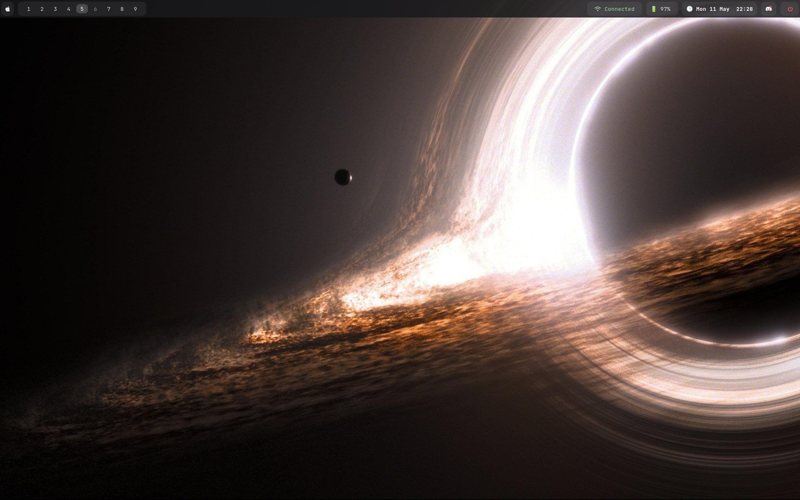

# Dotfiles for Void Linux

Minimal River (Wayland compositor) setup combining functionality and simplicity. Requires `river`, `rivertile`, `waybar`, `foot`, `fuzzel`, `swaybg`, `swaylock`, `mako`, `gammastep`, `playerctl`, `grim`, `wl-clipboard`, `cliphist`, and `pipewire`. Includes wallpaper management, notification daemon, and various scripts for power menu, wallpaper selection, and notifications. Copy dotfiles to your home directory, install dependencies, adjust variables, start River, and enjoy.

## Nix Sync Script

`nix-sync.sh` syncs Nix applications and icons to local share directories, optionally updates all Nix packages, and performs cleanup and optimization.

Usage: Run `./nix-sync.sh` and follow the interactive prompts for updating and cleaning.

## License

This project is licensed under the MIT License - see the [LICENSE](LICENSE) file for details.

